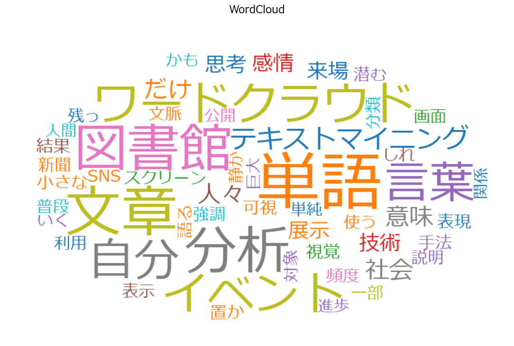
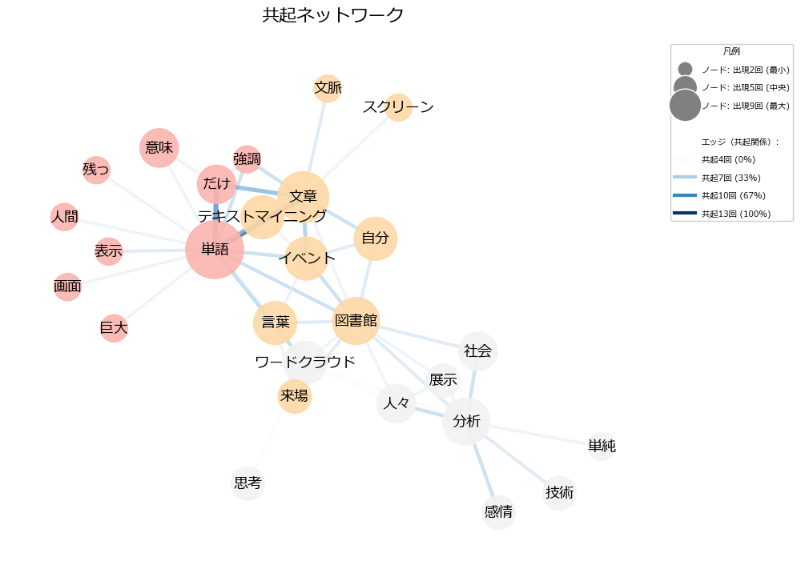

# JapaneseWordCloudGUI

日本語テキストを形態素解析し、WordCloud・共起ネットワーク・頻度グラフを作成できるデスクトップGUIアプリです。SudachiPy + sudachidict_core を用いた分かち書きに加え、ストップワード編集や連語結合（2〜4語のルールで単語をまとめる）が行えます。

## 主な機能
- テキスト入力（直接入力/ファイル読込/CSV列結合/サンプル）とストップワード管理
- 分かち書き結果をタブ2で確認し、連語結合ルールを追加・プレビュー・適用
- 単語頻度リストの表示・検索・削除・品詞で一括削除
- WordCloud生成（矩形/楕円/カスタム画像マスク、行ごと重複排除オプション）
- 共起ネットワーク生成（スライディング窓 or 行単位、連続重複の圧縮、行内重複ペア抑制、凡例表示）
- 頻度グラフおよび共起頻度表の表示・CSV/画像出力
- 画像保存（PNG/SVG）とCSVエクスポート

## 動作環境
- Python 3.10+ を想定
- 必要ライブラリは `requirements.txt` を参照（主要: tkinter, pillow, wordcloud, sudachipy, sudachidict_core, networkx, matplotlib, japanize-matplotlib）
- SudachiPy は基本的に `pip install sudachipy sudachidict_core` で利用可能です。環境によっては追加の辞書データ配置が必要な場合があるため、詳細は Sudachi のドキュメントを参照してください。
- フォント: Windows の Meiryo を想定。別環境は `C:\Windows\Fonts\meiryo.ttc` を適宜変更

## セットアップ
```bash
pip install -r requirements.txt
```
SudachiPy + 辞書が未導入の場合は OS に応じてインストールしてください。

## 使い方
1. `python main.py` を実行すると GUI が起動します。
2. タブ1でテキストを入力または読み込み、「分かち書き実行」で単語抽出します。
3. タブ2で連語結合ルールを追加し、プレビューまたは「適用して編集領域を更新」で反映します。
4. タブ3で単語編集や検索・削除を行い、右側のサブタブから WordCloud/共起ネットワーク/頻度グラフを生成します。
5. 生成結果はボタンから画像またはCSVとして保存できます。

## トラブルシュート
- SudachiPy が見つからない / 辞書が読めない: `pip install sudachipy sudachi-dictionary-full` を実行し、必要に応じて Sudachi の設定ファイルを確認してください。
- フォントが見つからない: `main.py` 冒頭の `font_path` を環境にある日本語フォントに変更してください。
- カスタム画像マスク: 透過PNGなどを推奨し、生成サイズに合わせてリサイズされます。

## ライセンス / 第三者ソフトウェア
- `tkinter` は Python に同梱されており、Python Software Foundation License に従います。
- `wordcloud` (MIT License)、`networkx`・`numpy`・`matplotlib` など（BSD 系ライセンス）、`Pillow` (HPND/PIL License) を使用しています。
- 形態素解析では `SudachiPy` (Apache License 2.0) と `sudachidict_core` (Apache License 2.0) を利用しています。辞書には IPA 辞書由来の BSD ライセンスデータが含まれるため、再配布時は SudachiDict の LICENSE/NOTICE を同梱してください。
- デフォルトフォントは Windows 付属の Meiryo を想定しています。再配布時は Microsoft のフォントライセンスを遵守するか、再配布可能なフォントに差し替えてください。
- `requirements.txt` に記載の各パッケージの LICENSE/NOTICE を確認し、配布物に必要な文言があれば併せて同梱してください。

## 出力例


